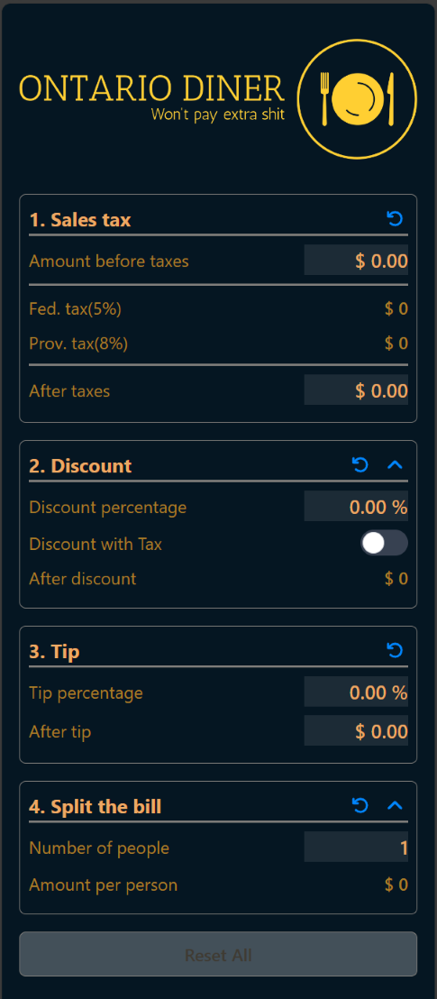

# 🍁 Ontario Diner - Bill Splitting and Tipping Made Easy! 🍽️

**“Won’t pay extra 💩”**

Welcome to **Ontario Diner**, a sleek and intuitive web-based application that helps you calculate taxes, discounts, tips, and split the bill—because nobody likes math at the dinner table! Whether you're dining out with friends, family, or colleagues, **Ontario Diner** has got you covered with a no-nonsense, user-friendly interface.

---

### 🛠️ Tech Stack

- **[TypeScript](https://www.typescriptlang.org/) + [React.js](https://react.dev/)**: A strongly-typed, component-based frontend experience.
- **[VitePWA](https://github.com/vite-pwa/vite-plugin-pwa)**: Creating PWA version from web app
- **[TailwindCSS](https://tailwindcss.com/)**: Sleek and responsive UI design.
- **[Vite](https://vitejs.dev/)**: A fast and efficient development environment.
- **Quality Control**: **[ESlint](https://eslint.org/)** + **[Prettier](https://prettier.io/)** for coding quality, **[lint-staged](https://github.com/lint-staged/lint-staged)** + **[Husky pre-hooks](https://github.com/typicode/husky#readme)**  for pre-commit & pre-push hook
- **Testing**: **[Vitest](https://github.com/vitest-dev/vitest)**, **[react-testing-library](https://github.com/testing-library/react-testing-library#readme)**

---

### 📷 Screenshot

---

### 🎨 Features

- **🔢 Simple Tax Calculation**: Automatically calculates federal and provincial taxes based on your meal's pre-tax amount.
- **🎯 Discounts**: Apply discounts easily and see how much you save in real-time. Option **Discount with Tax** for more cases.
- **💸 Tip Calculation**: Customize your tip percentage to see how much extra you’re paying.
- **👥 Split the Bill**: Easily divide the bill among friends and family.
- **💻 Web-Based Application**: Accessible anytime, anywhere through your web browser.
- **📱 Progressive Web App (PWA)**: Installable on mobile devices for offline access. Perfect for when you're on the go!

---

### 🌐 PWA Ready - Install & Go!
- Ontario Diner is designed as a Progressive Web App (PWA). This means:
    - **Offline Support**: Use the app even when you’re out of network coverage.
    - **Installable**: Pin it to your home screen on mobile devices for quick access, just like a native app.

---

### 👨‍💻 Contributing
Contributions are welcome! Please feel free to fork the repo and submit pull requests. Let’s make bill splitting a breeze together!

---

### 📜 License
This project is licensed under the MIT License. See the [LICENSE.md](LICENSE.md) file for more details.

---

Happy dining with **Ontario Diner**—where you’ll never pay extra sh*t again! 🍻

